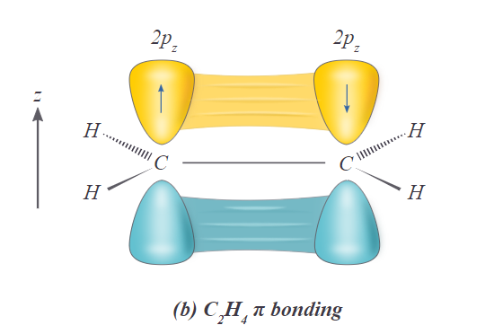

# Otimizando a Busca pela Menor Energia 

 **Alunos**: Cauê Gomes Correia dos Santos, Izaque Junior Oliveira Silva e Karla Rovedo Pascoalini. 
 **Professor**: Daniel Roberto Cassar. 
 **Disciplina**: Redes Neurais e Algoritmos Genéticos 
___
## Objetivo
Este trabalho tem como objetivo desenvolver um algoritmo genético para otimizar a busca pela menor energia de uma molécula, dado um conjunto de átomos, através do método de Huckel.

## Arquivos neste Github:

- `GA_forNsiteMolecule`: notebook contendo referências e explicações acerca do nosso raciocínio para desenvolver o nosso trabalho.
  
- `scripts.py`: arquivo contendo as funções que são utilizadas no notebook jupyter.

- `LICENSE`: arquivo que contém o tipo de licença deste repositório.

- `README.md`: arquivo que armazena as informações deste readme.

- `ligacaoPiOrbitalp.png`: imagem que demonstra a ligação pi dos carbonos com orbitais p livres

## Bibliotecas necessárias para rodar o notebook:

- **numpy**
  
- **random**

- **scripts**

## Introdução [7][8]

O trabalho 'Hamiltonian for n-site molecules'[2] desenvolvido pelo aluno Cauê Santos, turma 2023, com orientação do professor e pesquisador Felipe Crasto, foi um trabalho realizado com intuito de calcular a menor energia do hamiltoniano de cada conformação possível de uma molécula. Esse cálculo foi baseado num importante método físico chamado de Método de Huckel.

O Método de Huckel diz que pode-se calcular a energia, que é o autovalor do hamiltoniano, como uma aproximação que considera apenas elétrons p deslocalizados, que pode ser considerado uma versão mais sofisticada do modelo de elétrons livres. O MH (método de Huckel) considera apenas elétrons p se movendo numa rede de ligações-π (pi).

De acordo com esse método, pode-se escrever o hamiltoniano de um hidrocarboneto qualquer dessa forma:

$$\begin{bmatrix}
\beta & \alpha & \alpha\\
\alpha & \beta & \alpha \\
\alpha & \alpha & \beta
\end{bmatrix}$$
    
De forma que sua diagonal principal representa a energia no sítio, ou seja, a energia do elétron no átomo, e todos os outros elementos da matriz representam a energia de hopping, essa é a energia necessária para um elétron pular de um átomo para outro. Neste trabalho foi considerado a energia do sítio igual a 0 e a energia de hopping sendo um um valor binário, 0 ou 1, ou seja, o hamiltoniano representa uma matriz de adjacência.

Calcular os autovalores desse hamiltoniano é calcular os níveis energéticos dele e, portanto, descobrir quais níveis estão desocupados para os elétrons livres ocuparem. Note que a quantidade de elétrons livres, para esse caso, é de 1 para cada átomo. Ou seja, para o caso de uma rede de 6 átomos, há 6 elétrons livres. Onde cada dupla ocupa 1 nível, podendo haver elétrons desemparelhados, ou seja, isolados.

A questão com o trabalho desenvolvido é que ele calcula o nível de energia de todas as conformações possíveis de uma cadeia de N átomos e, então, retorna a menor. Para, por exemplo, uma cadeia de N=2, apenas 2 conformações são possíveis. Mas, ao aumentar de 1 em 1, nota-se um padrão exponencial na quantidade total de conformações da cadeia. Para 5 átomos, são 1024 conformações. Para 7, 2 milhões.
A equação que calcula a quantidade de conformações totais é a seguinte [10]

$$c_{total} = 2^{\frac{N(N-1)}{2}}$$

Por conta disso, o código é visivelmente não otimizado. Dado esse problema, pensamos em criar um algoritmo genético de minimização que retorna a melhor energia de uma matriz de ordem N.

Porém, sabe-se que este algoritmo não calcula a energia de todas as conformações possíveis, pois isto demandaria um poder computacional imenso. Ele calcula de algumas e, por meio da seleção por torneio, define os melhores candidatos para seguirem para a próxima geração e devolve uma energia do melhor hamiltoniano encontrado. Ou seja, não necessariamente ele encontrará o mínimo global das conformações, mas procura encontrar o mais próximo disso.

## Desenvolvimento
Durante o tempo de produção do trabalho contamos com a ajuda do professor e pesquisador Dr. Felipe David Crasto de Lima [2], que nos auxiliou na compreensão do método do cálculo da energia total e eventuais dúvidas que surgiram durante o trabalho. 

Para a otimização do código [3], utilizamos a rotina apresentada em sala de aula: selecao -> cruzamento -> mutacao -> hall da fama. Além do fato que criamos nossa própria população (Passo anterior a seleção, obviamente).

- Para realizar a seleção dos indivíduos, utilizamos a seleção por torneio, que, no nosso caso, escolhe 3 indivíduos da população, calcula o `fitness` de cada um e, como queremos minimizar, o indivíduo que vence o torneio é o que possui a menor energia total entre os três.

- Para o cruzamento, implementamos o `cruzamento de ponto simples`, porém com uma adaptação, visto que nossos indivíduos são matrizes. Ao cruzar um pai1 com pai2, pega-se as linhas iniciais da matriz para o pai1 e as linhas finais para o pai2. Lembrando que esta matriz é triangular superior, portanto, em sua diagonal principal e tudo abaixo dela, tem valor 0.

- Para a mutação, implementamos a mutação similar à `mutação simples para caixas binárias`. Novamente, utilizamos do conhecimento prévio sobre o problema para determinar que a mutação somente pode ocorrer para `genes` acima da matriz diagonal e nunca na matriz diagonal.

## Conclusão

Ao final de tudo, o código rodou da forma que foi de nosso interesse, de forma a calcular as energias minimizadas para diversas gerações bem mais rápido que o código não otimizado e com energias mínimas próximas, se não equivalenteas, às do código que tenta todas as conformações, garantindo uma solução bem-sucedida do grupo.

## Referências Bibliográficas
 [1] Cassar, Daniel Roberto. GA 4.2 - Notebook Descobrindo a senha. 

 [2]Santos, C. e Lima, F. - Hamiltonian for n-site molecules  

 [3] Cassar, Daniel Roberto. ATP-303 GA 2.3 - Notebook algoritmo genético  

 [4] numpy.org - Função ArgMin do Numpyhttps: //numpy.org/doc/stable/reference/generated/numpy.argmin.html  

 [5] docs.python.org - Função Format e Zfill: https://docs.python.org/pt-br/3/tutorial/inputoutput.html  

 [6] Alura - Desempacotando tuplas: https://www.alura.com.br/artigos/entendendo-o-desempacotamento-no-python  

 [7] Libre Texts - 4.13C: Hückel MO Theory: https://chem.libretexts.org/Bookshelves/Inorganic_Chemistry/Map%3A_Inorganic_Chemistry_(Housecroft)/04%3A_Experimental_Techniques/4.13%3A_Computational_Methods/4.13C%3A_Huckel_MO_Theory 

 [8] Cercomp.ufg - Huckel.ppt: https://files.cercomp.ufg.br/weby/up/56/o/Quantica_-_metodo_huckel_visao_geral.pdf 

 [9] PrOgRaMaNdO - 08 - Algoritmos Genéticos - Métodos de Seleção de Indivíduos: https://www.youtube.com/watch?v=zQLuryIF-pU 

 [10] StackOverFlow.com - How to write LaTeX in IPython Notebook?: https://stackoverflow.com/questions/13208286/how-to-write-latex-in-ipython-notebook 

 [11] GeeksForGeeks - Python | random.sample() function : https://www.geeksforgeeks.org/python-random-sample-function/ 

  [12] Fernando dos Santos - Algoritmos Genéticos: Roleta (vídeo extra) : https://www.youtube.com/watch?v=c2uPOs3VawU  
